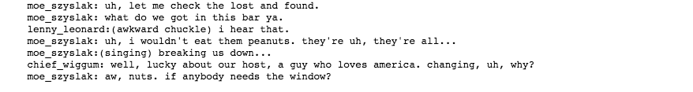

# Simpson Script Generator

In this project, we'll generate our own Simpsons TV scripts using RNNs. we'll be using part of the [Simpsons dataset](https://www.kaggle.com/wcukierski/the-simpsons-by-the-data) of scripts from 27 seasons. The Neural Network we'll build will generate a new TV script for a scene at Moe's Tavern.
 

     

# Generated Text
Below is a sample of generated text. the quality of the model can ba optimized by using more data, since our current was is way to small.

